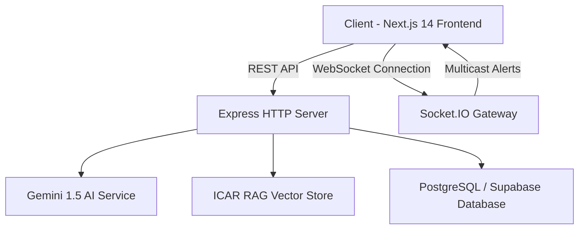

# 🌾 Kisaan Sahayak (किसान सहायक)
> **AI-Powered Smart Agricultural Ecosystem & Real-Time Advisory System**

[](https://nodejs.org/)
[](https://nextjs.org/)
[](https://www.typescriptlang.org/)
[](https://socket.io/)
[](https://ai.google.dev/)
[](https://www.postgresql.org/)

**Kisaan Sahayak** is a full-stack, enterprise-grade agricultural intelligence platform built to bridge the technology gap for farmers across India. It integrates **Real-Time WebSocket Emergency Multicasting**, **Retrieval-Augmented Generation (RAG)** over ICAR agricultural research datasets, **AI-Driven Voice & Visual Diagnostics**, and real-time mandi prices into a seamless, accessible web interface.

---

## 🚀 Key Features

### ⚡ 1. Real-Time District Alert Multicasting (Socket.IO)
- **District-Based Rooms**: WebSocket server groups connected farmers into dedicated district rooms (e.g., `district-punjab-ludhiana`, `district-mh-nashik`).
- **Emergency Broadcasts**: Instant multicast delivery of severe weather warnings, sudden pest infestation alerts, and government scheme notifications with zero latency.
- **Live Frontend Banner**: High-priority alert banner integrated across the UI for emergency notifications.

### 🌾 2. ICAR RAG Knowledge Base & AI Chatbot
- **Context-Aware Assistance**: Implements Retrieval-Augmented Generation (RAG) using cosine similarity over embedded vector stores.
- **ICAR Standard Guidelines**: Grounded responses utilizing authoritative data from the Indian Council of Agricultural Research (ICAR) covering crop rotation, bio-pesticides, fertilizer schedules, and disease management.
- **Gemini AI Integration**: Uses Google Gemini 1.5 Flash for high-speed, multilingual query processing and response formatting.

### 🎙️ 3. Multimodal Voice & Visual Crop Diagnostics
- **Voice Assistant**: Hands-free voice interface tailored for accessibility in rural farming environments.
- **Crop Disease Identification**: Image-based diagnostic engine analyzing leaf damage, fungal infections, and nutrient deficiencies with step-by-step treatment recommendations.

### 📊 4. Market Prices & Weather Forecasts
- Real-time updates for APMC mandi rates across major crop categories.
- Hyper-local microclimate weather predictions to aid irrigation planning.

---

## 🛠️ Architecture & Tech Stack



| Layer | Technologies Used |
|---|---|
| **Frontend** | Next.js 14 (App Router), React 18, Tailwind CSS, Lucide React, Socket.IO Client |
| **Backend** | Node.js, Express.js, TypeScript, Socket.IO Server, CORS, Dotenv |
| **AI / ML** | Google Generative AI SDK (`gemini-1.5-flash`), Embeddings, In-Memory/pgvector RAG |
| **Database** | PostgreSQL with `pgvector` extension, Supabase Client |

---

## 📁 Repository Structure

```
Agritech/
├── backend/
│   ├── database/
│   │   ├── schema.sql           # Complete relational database schema (farmers, crops, alerts)
│   │   └── rag_schema.sql       # pgvector vector store schema for ICAR knowledge embeddings
│   ├── src/
│   │   ├── config/              # Env validation, Supabase & AI client initializations
│   │   ├── controllers/         # Express controllers (alert, chat, disease, RAG)
│   │   ├── data/                # Seed ICAR knowledge base documents
│   │   ├── middleware/          # Auth verification and global error handler
│   │   ├── routes/              # Express API route modules
│   │   ├── services/            # Core business logic (Gemini, RAG engine, Socket.IO)
│   │   ├── types/               # TypeScript interfaces & DTO definitions
│   │   ├── app.ts               # Express app configuration
│   │   └── server.ts            # HTTP & Socket.IO server entry point
│   ├── Start.ts                 # Dev startup launcher with dotenv registration
│   └── package.json
│
├── frontend/
│   ├── app/                     # Next.js 14 App Router pages (chatbot, voice, alerts)
│   ├── components/              # UI components & Emergency Alert Banner
│   ├── lib/                     # Socket.IO client instance & helpers
│   └── package.json
│
└── README.md
```

---

## ⚙️ Getting Started

### Prerequisites
- **Node.js**: v18.0.0 or higher
- **npm**: v9.0.0 or higher
- **PostgreSQL / Supabase Account** (Optional for vector storage)
- **Google Gemini API Key** ([Get key here](https://aistudio.google.com/))

---

### Installation & Setup

#### 1. Clone the Repository
```bash
git clone https://github.com/dhruvsshah2005/Agritech.git
cd Agritech
```

#### 2. Backend Setup
```bash
cd backend
npm install
```

Create a `.env` file inside `backend/`:
```env
PORT=3000
NODE_ENV=development
GEMINI_API_KEY=your_google_gemini_api_key
SUPABASE_URL=your_supabase_project_url
SUPABASE_KEY=your_supabase_anon_key
```

Start the backend server:
```bash
npm run run
```
> The backend server will initialize on `http://localhost:3000` alongside the Socket.IO server and load the ICAR RAG knowledge base.

#### 3. Frontend Setup
```bash
cd ../frontend
npm install
```

Start the Next.js development server:
```bash
npm run dev
```
> Open `http://localhost:3000` (or `http://localhost:3001` if port 3000 is occupied by backend) in your browser.

---

## 📡 API Overview

| Endpoint | Method | Description |
|---|---|---|
| `/api/v1/chat/message` | `POST` | Process query via Gemini AI with agricultural context |
| `/api/v1/rag/query` | `POST` | Query the ICAR vector database for domain knowledge |
| `/api/v1/alerts/broadcast` | `POST` | Multicast an emergency advisory to connected district sockets |
| `/api/v1/disease/diagnose` | `POST` | Analyze crop image for disease identification & remediation |

### ⚡ Socket.IO Real-Time Events
- **Client Emit**: `join-district` — Parameter: `{ district: string }`
- **Server Multicast**: `district-alert` — Payload: `{ id, district, title, message, severity, timestamp }`

---

## 𝒬 Database Setup

To set up the database tables and `pgvector` schema, run the SQL scripts against your PostgreSQL instance:
```bash
psql -U postgres -d kisaan_db -f backend/database/schema.sql
psql -U postgres -d kisaan_db -f backend/database/rag_schema.sql
```

---

## 📜 License

Distributed under the MIT License. See `LICENSE` for details.

---

## 👨‍💻 Authors & Contributors

- **Dhruv Shah** ([@dhruvsshah2005](https://github.com/dhruvsshah2005))
